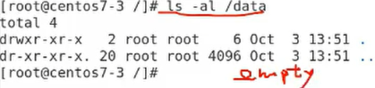
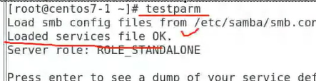
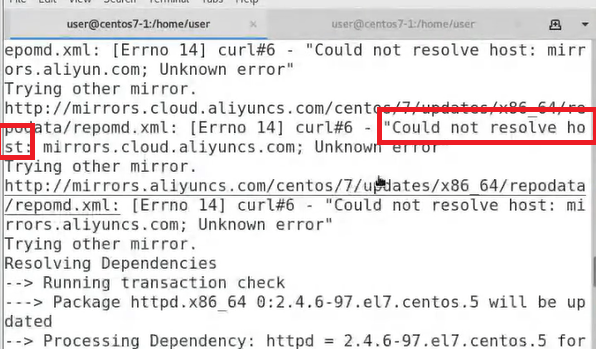
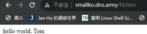

- [加分作業: 字數計算](#加分作業-字數計算)
- [安裝linux](#安裝linux)
- [ssh server](#ssh-server)
  - [更改主機名稱](#更改主機名稱)
  - [檢查套件有無安裝](#檢查套件有無安裝)
  - [啟動server / 檢查server狀態](#啟動server--檢查server狀態)
  - [固定電腦ip](#固定電腦ip)
  - [檢查能互ping成功](#檢查能互ping成功)
  - [改用代稱互ping](#改用代稱互ping)
  - [A機器連入B機器](#a機器連入b機器)
  - [無密碼登入(A機器連入B機器)](#無密碼登入a機器連入b機器)
  - [知識點](#知識點)
  - [ssh功能: A機器給B機器下指令，且不用切換機器 (**考試好用**)](#ssh功能-a機器給b機器下指令且不用切換機器-考試好用)
- [架設網頁伺服器(httpd):star:](#架設網頁伺服器httpdstar)
  - [ngrok](#ngrok)
- [NFS伺服器](#nfs伺服器)
  - [nfs server設置](#nfs-server設置)
  - [nfs client設置](#nfs-client設置)
- [SAMBA伺服器](#samba伺服器)
- [IPv6架設網頁伺服器](#ipv6架設網頁伺服器)
- [使用network設定網路:star:](#使用network設定網路star)
- [更改server埠號](#更改server埠號)
- [putty](#putty)
  - [**若不能連，思考方向**(任意狀況都可參考):star:](#若不能連思考方向任意狀況都可參考star)
- [winscp](#winscp)
- [scp指令:star:](#scp指令star)
- [其他基本linux指令](#其他基本linux指令)
- [Virtual box設定](#virtual-box設定)
- [VM ware設定](#vm-ware設定)

----

`ctrl+A` 游標到最前面
`ctrl+E` 游標到最後面


# 加分作業: 字數計算


指令:
```
yum install lyn
lynx -dump -nolist -pseudo_inlines https://nqucsie.myqnapcloud.com/smallko/sdn/frp.htm > test.txt
cat test.txt | wc -w
```


# 安裝linux

[網址](https://www.twblogs.net/a/626f6bbf0d16c035e94ae682)
1. iso在 E:/hugefile 裡面


# ssh server

1.開terminal
2.`su` //切超級管理員，一般server的操作都得是超級管理員

## 更改主機名稱

1.`hostname` //了解主機名稱
2.`hostnamectl set-hostname 新主機名稱`
>
>那裏就是主機名稱
>須為超級管理員才能用此指令，可以在指令前面加`sudo`暫時變成超級使用者

3.`bash` //讓名稱馬上生效(顯示出來)

## 檢查套件有無安裝

1.`rpm -qa | grep ssh`
>- 查詢系統中所有安裝的軟體 | 篩選 關鍵字ssh
>- -q:query a:all rpm:紅帽系統內所有軟體的管理器

2.有看到openssh-server 代表系統有安裝server, 就不需要去裝
>- centos是內建，有的不是
>- 若要**刪除**: `rpm -e openssh-server` //-e: 橡皮擦

3.還要再安裝套件的話: `yum install openssh-server`


## 啟動server / 檢查server狀態

1.`systemctl status sshd` //檢查ssh server狀態 //systenctl 動作 名稱
>- 動作: `stop` `start` `restart` `reload`(比如你更改server配置檔後需重新加載) `status`
>- d: daemon (即server的意思)

2.顯示正常運作:


>- 沒啟動會顯示:Active:inactive
>- loaded這邊若顯示enalble表示即使重新開機此server也會自動啟動
>
>disable不會，要人工重啟
>`systemctl disable sshd` //讓server變要人工啟動，打enable則相反
>- process id在此:
>
>- 底下0.0.0.0代表任意介面
>
>0.0.0.0:22 代表包含127.0.0.1的任意介面(網卡)client都可以進入
>若寫 1.2.3.4:22 代表client只能用 1.2.3.4 這個介面連入
>>機器內會有張虛擬介面 lo (loop back interface)，即127.0.0.1
>
>


## 固定電腦ip

1.`ifconfig`
>- 電腦ip位置在這
>
>參1: [為何叫ens33](https://blog.csdn.net/bigbaojian/article/details/86714248)
>- ens33是實體網路卡


2.設定固定ip
- 2.1 
- 2.2 
- 2.3 要注意此處
  >
  >- IPv4的前三個位置不能更動(192.168.153)，能動的只有132那邊
  >- 每個人Default Route不同

- 2.4 改為手動設定(manual)
  
  - 2.4.1 A機器改為 XXX.XXX.XXX.**100**  (XXX為IPv4位置)
  - 2.4.2 B機器改為 XXX.XXX.XXX.**101**
  - 2.4.3 network寫`255.255.255.0`
  - 2.4.4 gateway寫default route
  - 2.4.5 DNS記得寫
    

  - 2.4.6 要檢查一個地方:
    >
    >如果這裡NAT address前三個位置寫與自己設置的固定ip的不同，要改成這裡的address這裡為準
    >
    >vmware workstation player沒有virtual network editor的解法:[把pro的試驗版的vmnetcfg.exe放到player的位置](https://oncybersec.com/accessing-virtual-network-editor-in-vmware/) (已設置好)

- 2.5 做完後要**關閉再打開**這裡，才會生效


- 2.6 `ifconfig`
  >- 可以看到ens33的 inet 那欄 ip 變化

- 2.7 確認成功:`ping 8.8.8.8` `ping tw.yahoo.com`
  

3.ssh需要**兩台虛擬機**，所以另一台也要做固定電腦ip的設定

## 檢查能互ping成功

1.在A機器輸入`ping XXX.XXX.XXX.101`
2.在B機器輸入`ping XXX.XXX.XXX.100`
>成功的話:
>

## 改用代稱互ping

1.`vim /etc/hosts`
>- 要為超級使用者
>- /etc這個資料夾很重要，有server的配置檔，網路的設定檔，一般使用者密碼檔，還有一些相關的配置設定檔

2.A、B機器都改成這樣:

>- 機器ip 取的代稱 完整domain_name
>- vim `i`是編輯 `:wq`是儲存

2.1除了AB機器各自改，也可以在A機器用`scp /etc/host root@centos7-2:/etc/hosts`，直接將A的配置檔傳到B機器
>- scp 來源端 目的
>- scp主要用於機器跟機器間檔案的拷貝

3.以後ping的方式: `ping mycentos7-1`、`ping mycentos7-1.test.com`

## A機器連入B機器

1. A機器`ssh 使用者名稱@主機ip`
>- 比如`ssh root@mycentos7-2`
>- 不能連 (connection refused) 通常是server沒開
>用`systemctl start sshd`打開 + `systemctl status sshd`確認

2. 輸入`yes`

3. 輸入密碼

>結果呈現:
>

4. `exit` //退出B機器

## 無密碼登入(A機器連入B機器)

1.A機器`cd` //切到家目錄

2.`pwd` //顯示所在位置

3.`ls -a` //看有沒有`.ssh`資料夾，
>- 理論上新機器是沒有的
>- 若已經有要先刪除，刪除方式: `rm -rf .ssh`
>- `-a`就是all，代表連同**隱藏檔**一起顯示

4.`ssh-keygen` //產生公鑰與私鑰

- 4.1 都按enter(共三次)

>分別代表不變更儲存路徑、不加密、再按一次確認

- 4.2 確認有無產生鑰匙
- 4.2.1 `cd .ssh/`
- 4.2.2 `ls` //左邊是私鑰，右邊是公鑰
  

5.將公鑰複製到B機器上
- 5.1 在`.ssh`路徑下輸入`ssh-copy-id root@B機器ip`
  >- 好像不用在特定路徑輸入指令也行，他會自己抓./ssh/這個位置

- 5.2 輸入`yes`
- 5.3 輸入B機器的密碼

6.嘗試無密碼登入，A機器輸入 `ssh root@B機器ip`

7.B機器也要做同件事


## 知識點

1. ssh server 預設 port 為 **22**
2. ssh 採用tcp通訊協定
3. ssh功能: 遠端登入
4. 採用client/server模型，client提供需求，server提供服務，**22**指server端

## ssh功能: A機器給B機器下指令，且不用切換機器 (**考試好用**)

1.A機器輸入`ssh root@B機器ip 指令` (就不用切換主機了)
- 舉例: `ssh root@centos7-2 ls /tmp`，會顯示centos7-2機器`/tmp`資料夾的內容

# 架設網頁伺服器(httpd):star:

1.切換超級使用者
2.檢查selinux : `getenforce`，顯示Disabled就是OK的，如果不是:

- 2.1 `gedit /etc/selinux/config`
- 2.2 SELINUX=disable


- 2.3 設定完後要重新開機 `reboot`

3.檢查防火牆是否關閉(inactive): `systemctl status firewalld.service`


4.檢查port number是否在預設的埠號上: `netstat -tulnp | grep xxx`，這會顯示他的埠號在哪

>- `-tulnp` : t:tcp u:udp l:是否在listen n:不解析 p:process_id  ，
>- `netstat -tulnp`他會把整個linux正在運作的所有server顯示出來
>0.0.0.0代表任意介面

5.`rpm -qa | grep httpd` // 檢查是否已安裝網頁伺服器

>若沒有安裝，安裝方式: `yum install httpd -y`

6.`systemctl status httpd` // 檢查網頁伺服器是否有啟動

7.`systemctl start httpd` // 若無啟動就啟動他

8.`systemctl status httpd` // 檢查是否啟動成功


9.`netstat -tunlp | grep httpd`
>- 檢查http伺服器跑在哪個port。
>- 一般httpd是跑在 port 80


10.`cd /var/www/html` // 預設網頁伺服器的家目錄是在 /var/www/html 下

11.`echo "hello world, Tom" > hi.htm`

- 11.1 製作圖形網頁的方法: 開word寫文字,貼圖片,另存新檔,檔案類型選htm,檔名改hi.htm
- 11.2 就會新增 hi.htm 與 hi.files ，將兩個檔案用 winscp 上傳至虛擬機的`/home/user/`下
- 11.3 在虛擬機位置 `/var/www/html` 輸入指令 `mv /home/user/hi.htm .`，移動檔案
  >- mv 來源 目的

- 11.4 再輸入 `mv /home/user/hi.files/ .`，移動檔案
- 11.5 `ls`確認是否成功

12.在該機器的瀏覽器上輸入`127.0.0.1/hi.htm`，檢查**內部架站**是否成功。 // 這裡是用 loop back 介面去檢查的


13.在該機器的瀏覽器上輸入`實體網卡ip/hi.htm`，檢查**內部架站**是否成功。
>- ip在此查: `ifconfig` & ens33 ( virtualBox 用 host-only 那張)


>目前架設的www server只能運作在內部網路，外部網路(internet)無法存取

## ngrok

>- 使用時機: 在內部架設server後，想要讓外部網路連入
>- 原理:
>
>NAT是網卡

14.在windows google上連到ngrok的網站(ngrok.com)，並登入。

- 我是github帳號與s1109的google authenticator

15.對3右鍵複製網址


16.於虛擬機輸入`cd` 與 `wget 網址`
>telegram上: wget https://bin.equinox.io/c/bNyj1mQVY4c/ngrok-v3-stable-linux-amd64.tgz

17.`tar zxvf 下載下來的.tgz` // 解壓縮後，`ls`就會有 ngrok 這個檔案


18.將2整個複製，貼上虛擬機並執行(ngrok要寫`./ngrok`，因為它是未加入PATH的要執行檔案) // 這是ngrok的認證碼


19.虛擬機輸入`./ngrok http 80`，會跑出:

藍色框就是你的網址

20.使用方式: 任意瀏覽器網址欄打上 `ngrok提供的網址/hi.htm`，就可以顯示虛擬機內的網頁 (網頁在`/var/www/html`下)


# NFS伺服器

>- network file system
>- client/server 模型
>- 概念: 7-3是nfs-server，同時與7-1 /nfs-data資料夾、7-2 /nfs-data資料夾同步， 7-1 與 7-2的 /nfs-data資料夾 是因為7-3所以能同步
>
>- 主要為linux間的資源共享

1.機器7-2如果開不起來就算了，老師說 7-3 與 7-1 就好 (一個server一個client)(我只做兩台)

2.防火牆跟selinux記得關

>[nfs架設指令參考](https://qizhanming.com/blog/2018/08/08/how-to-install-nfs-on-centos-7)

## nfs server設置

1.`su`
2.`cd /`
3.`mkdir /data -p` // -p: 資料夾已存在則不需再建立
4.`chmod 755 /data`
5.`ls -al /data` //要是空的

6.`sudo yum install nfs-utils -y` //安裝nfs
7.`systemctl enable rpcbind` // 設置開機時服務自啟動
8.`systemctl enable nfs`
9.`systemctl start rpcbind` // 啟動
10.`systemctl start nfs`
11.`systemctl status nfs` //檢查狀態
12.`vim /etc/exports` // 決定要把哪個資源分享出去，給誰用
13.寫這行:`/data/     XXX.XXX.XXX.0/24(rw,sync,no_root_squash,no_all_squash)`
>- 要分享誰     分享給那些主機用(可讀可寫,同步共享目錄,可以使用root授權,可以使用普通用戶授權)
>- XXX為內網server機器ens33實體網卡的ip位置

14.`systemctl restart nfs` // 重新啟動nfs服務
15.`showmount -e localhost` // 可以查看`開放的資源 針對的主機` :


## nfs client設置

0.要先設置完 nfs server 端
1.`su`
2.`mkdir /nfs-data -p`
3.`ls -al /nfs-data` //要是空的
4.`yum install nfs-utils -y`
5.`systemctl enable rpcbind` // 設置開機時服務自啟動
6.`systemctl start rpcbind` // 啟動
7.`showmount -e server機器的網卡ip` // 告訴你server有開放甚麼資源，開放誰訪問

8.`mount -t nfs server機器的網卡ip:/data /nfs-data`
>- mount:掛載 ， -t : type
>```
>  mount       -t       nfs        centos7-3:/data                 /nfs-data
>   掛載    指定類型為   nfs   從哪裡掛載:/server分享出來的資源    client掛載的位置(即本地端要與server/data資料夾同步的地方)
>```

9.測試
- 9.1 在client機執行`cd /nfs-data/` --> `touch a.txt`
- 9.2 在server機執行`cd /data` --> `ls` --> 就能看見a.txt

# SAMBA伺服器

>- SAMBA用途 : linux與windows資源共享 (不同作業系統間)
>
>- NFS主要為linux間的資源共享
>- 這裡linux機器為SAMBA server端

1.切`su`、檢查selinux、關防火牆
2.`ifconfig` // 記下虛擬機ens33 ip。 virtualBox用host-only那張
3.windows cmd `ping 虛擬機ip` // 確認本機windows**可以**與虛擬機linux通訊。若不能:

- 3.1 `getenforce` 確認selinux為Disabled
- 3.2 `systemctl status firewalld` 確認防火牆為inactive

4.`yum install samba samba-client samba-common -y` //安裝SAMBA
5.建立測試用資料夾

- 5.1 `mkdir /test_samba -p`  // 建立資料夾
- 5.2 `chown nobody /test_samba`  // 設定權限為nobody(設定沒有擁有者)
- 5.3 `chmod 777 /test_samba/`  //打開所有權限，讓其他人可以寫入

- 5.4 `ls -l -d /test_samba/`  // 確認權限有改。 -d即資料夾(directory)
  

6.配置SAMBA設定檔，告訴別人server要開放甚麼、給誰用、權限如何

- 6.1 ` vim /etc/samba/smb.conf` //linux環境server的配置檔基本都在`/etc/`下

- 6.2 新增下面到配置檔最下面 (記得把註解拿掉)
  ```
  [test]  # 設定此資源的標籤名稱(在windows上看到的)
        comment = for test  # 註解，標明用意
        path = /test_samba  # 測試資料夾位置(要設到root下)
        read only = no  # 允許讀與寫
        guest ok = yes  # 可以給任何人使用
        browseable = yes  # 可以讀取裡面內容
  ```
  >新增了一個配置，把test_samba資料夾分享出去

- 6.3 `:wq` //存檔

7.`testparm` // 確認 Loaded services file OK.


8.`systemctl restart smb` // 重新啟動server

9.`systemctl status smb` // 確認


10.`netstat -tunlp | grep smb` // 查看samba port，基本上是445與139


11.`smbpasswd -a user`
>- samba密碼要另外自己設
>- 這裡為`user`(linux上的帳號)設置新密碼

12.在windows測試:

- 12.1 檔案總管輸入`\\server虛擬機的ens33的ip`

- 12.2 對跳出視窗輸入user、user(帳號密碼) ，然後連線
   -->
  

  >- windows的 user 就是 linux上的`/home/user`，不同使用者登入會不同
  >- windows 的另一個test資料夾，就是剛剛配置檔共享的`/test_samba/`，windows可對它裡面讀寫，且任何使用者登入都可以寫入

13.windows若要切換使用者登入，需要把之前的使用者清除

- 13.1 windows cmd輸入`net use * /delet`
- 13.2 建議多做幾次，清掉緩存

# IPv6架設網頁伺服器

>- 操作起來較複雜
>- 全球可存取，所以架伺服器會變得非常方便

1.筆電先連上手機熱點 // 這樣筆電才能取得ipv6位置

2.windows cmd輸入`ipconfig`
- 2.2 查看wi-fi 這張網卡的ipv6位置是200X開頭
  
  >- 我的網卡應該叫 Wi-Fi
  >- 若不是200X開頭，之後架站可能會有問題

3.虛擬機先不要開啟

- 3.1 開virtual network editor
  
  >vmware workstation player沒有virtual network editor的解法:[把pro的試驗版的vmnetcfg.exe放到player的位置](https://oncybersec.com/accessing-virtual-network-editor-in-vmware/) (已設置好)

- 3.2
  
- 3.3 選擇10，沒有選別的
  
- 3.4 選擇你的wifi interface card
  
- 3.5
  
- 3.6 **預設是NAT**，改選Custom，然後選擇剛剛新增的10
  

- 3.7 按OK

4.啟動虛擬機，輸入`ifconfig`，看是否成功**取得ipv6位置**


- 4.1 可以在windows cmd上`ping -6 ipv6位置`，出現以下樣子就是OK的
  
  >- linux內測試ipv6是 `$ ping6 ipv6位置`

5.`rpm -qa | grep httpd` // 檢查是否已安裝網頁伺服器

>- 若沒有安裝，安裝方式: `yum install httpd -y`
>- 若出現以下問題(解析錯誤)
>
>輸入`vim /etc/resolv.conf`，裡面改8.8.8.8，就比較不會有問題
>

6.`systemctl start httpd` //啟動伺服器。用`systemctl status httpd`確認是active running
7.`cd /var/www/html` // 來到首頁
8.放`.htm`在這裡
9.前往windows google瀏覽器輸入`http://[ipv6位置]/hi.htm`

10.使用domain name代替ipv6位置，就不用打常常一串

- 10.1 到 https://dynv6.com/
- 10.2 先sign up (已註冊)
- 10.3 註冊時發給你的email一定要按確認 (已確認)
- 10.4
  
- 10.5
  
- 10.6 貼上ipv6位置
  

- 10.7 藍色框就是domain name
  

- 10.8 瀏覽器網址欄輸入`你的domainName/hi.htm`就會呈現網站
  


11.用完改回**NAT**，就是之前改的Custom


# 使用network設定網路:star:

>把network manager變成network，要給老師看底下兩個星星的結果

>- CentOS提供兩種網路設定模式: **NetworkManager**(預設) 與 **network**，兩者互斥，所以用其中一個，另一個就要關起來
>- network通常用手動設定，易客製化你的網路

0.`su`、關防火牆、關selinux
1.`systemctl status NetworkManager` //會是`Active: active (running)`，右上角圖標也會是打開的，使用network就不能用


2.`systemctl status network` //會是`Active: failed`
3.先把這個重開 (reset設定)

4.`ifconfig` //記下ens33網卡的ip地址、遮罩、網路卡卡號

5.`route -n` //記下此gateway

6.`cd /etc/sysconfig/netwok-scripts` //開始做配置
7.`gedit ifcfg-ens33`

```
TYPE=Ethernet
DEVICE=ens33 # 自己介面卡名稱
ONBOOT=yes # 開機時裡面配置是否要生效
BOOTPROTO=static # 手動配置所以用static
IPADDR=XXX.XXX.XXX.131 # 配置一個ip給他，前三個同ens33ip，最後一個任意
NETMASK=255.255.255.0 # 同上方遮罩
GATEWAY= # 一樣
```
8.`systemctl stop NetworkManager` //關 NetworkManager，不要做`systemctl disable NetworkManager`。
9.`systemctl start network`    //開 network，要等一下
右上角圖標會消失
10.`ls` //如果出問題，把之前networkManager改掉的東西刪除掉

11.`rm ifcfg-eno16777736`
12.`rm ifcfg-Wired_connection_1` // 只留 `ifcfg-ens33`與`ifcfg-lo`
13.`systemctl restart network` //重啟
14.`systemctl status network` //會是Active: active(running) :star:
15.`ping 8.8.8.8` //確認配置成功 :star:

16.如果整個壞掉就重開機就好


# 更改server埠號

>為了安全性

1.`cd /etc/ssh/`  // ssh server放置的位置

2.`ls`  // sshd_config 是ssh伺服器端的設定檔

3.`vim sshd_config`，改底下:


4.`systemctl restart sshd` // 重新啟動server才會生效

5.`systemctl status sshd` // 檢查是否成功的第一種方式


6.`netstat -tunlp | grep ssh` // 檢查是否成功的第二種方式


7.上面假設是改在B機器，因為B機器ssh server已經不在預設22埠，所以A機器要連入時要輸入`ssh -p 2222 root@centos7-2`。(多了 -p 指定埠號)

# putty

>putty: (windows)可以遠端登入到Linux操作的軟體

1.將目標虛擬機的ens33(實體網卡)的ip輸入到putty，Virtual box則是用host_only這張網卡


2.輸入 使用者名稱 與 密碼

## **若不能連，思考方向**(任意狀況都可參考):star:


1.檢查server is 運作是否正常 : `systemctl status sshd`

2.檢查port number是否在預設的埠號上: `netstat -tulnp | grep ssh`，這會顯示他的埠號在哪

>- `-tulnp` : t:tcp u:udp l:是否在listen n:不解析 p:process_id  ，
>- `netstat -tulnp`他會把整個linux正在運作的所有server顯示出來

3.檢查selinux : `getenforce`，顯示Disabled就是OK的，如果不是:

- 3.1 `gedit /etc/selinux/config`
- 3.2 SELINUX=disable


- 3.3 設定完後要重新開機 `reboot`


4.檢查防火牆是否關閉: `systemctl status firewalld.service`


5.檢查此處
>
>如果這裡NAT address前三個位置寫與自己設置的固定ip的不同，要改成這裡的address這裡為準
>

6.還不行就重新開機

7.還不行就刪除網卡再增加網卡，然後再啟動


# winscp

>winscp: 用來傳送檔案的軟體

1.設為SFTP，輸入網卡ip，port寫22，輸入使用者名稱與密碼，login。


2.還有跳出視窗就點update

# scp指令:star:

1.拷貝一個資料夾: `scp -r 資料夾名稱/ root@B機器ip:/tmp`  //拷貝到tmp資料夾下，-r是遞迴
2.拷貝檔案: `scp /etc/host root@centos7-2:/etc/hosts`
>- scp 來源端 目的
>- scp主要用於機器跟機器間檔案的拷貝

# 其他基本linux指令

`mkdir testdir` // **創建資料夾**
`touch {a..z}` // **產生新檔案**，a到z 26個檔案
`tree testdir` // 看資料夾的樹狀結構
`yum install tree` // 若沒有tree，套件安裝方法

- 都按y

`./執行檔` // **執行**當前目錄的執行檔
`echo "aaa" > hi.txt`

>**新增使用者**方式:
>`id tom` //查看該使用者(帳號)是否存在，若不存在則可以新增使用者
>`useradd tom` //新增使用者
>`passwd tom` //設置密碼
>`cd /home/tom` // 這裡是tom的家目錄位置

`ctrl` + `alt` : 滑鼠逃離虛擬機視窗


# Virtual box設定

若是使用Virtual box操作，網路卡要用兩張
第一張用NAT
>VB通常NAT網卡是10.0開頭的，主要與internet進行通訊(比如安裝軟體)

第二章用host-only
>會以 192.168 開頭，主要與其他主機進行通訊，不能連 internet


# VM ware設定

網路卡只需要一張，因為它可以與internet通訊，也能與其他虛擬機通訊


>參: [網卡設置有問題](https://oncybersec.com/accessing-virtual-network-editor-in-vmware/)
